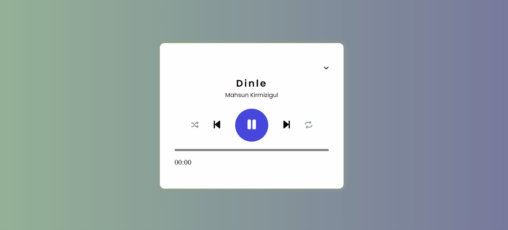

# Music Player Project



A simple web-based music player built using HTML, CSS, and JavaScript. It allows users to play, pause, skip songs, adjust the progress bar, and control playback options.

## Features

- Play and pause songs.
- Skip to the next or previous song.
- Adjust the song progress using the progress bar.
- Toggle shuffle and repeat modes.
- Display the current and total duration of the song.


## Installation

1. Clone the repository:

   ```bash
   git clone https://github.com/Advocateilker/MusicPlayer-JS

2. Open the index.html file in your preferred web browser.

Usage

Click the play button to start playing the current song.
Click the pause button to pause the song.
Click the next and previous buttons to navigate between songs.
Click the shuffle button to enable/disable shuffle mode.
Click the repeat button to enable/disable repeat mode.
Click on the progress bar to skip to a specific time in the song.
